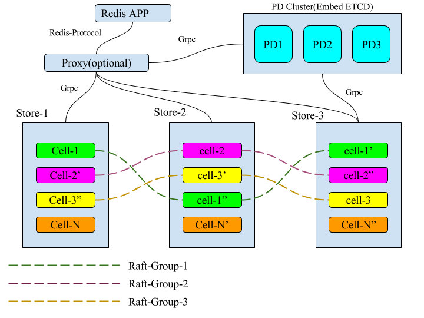

## What is Elasticell?

Elasticell is a distributed NoSQL database with strong consistency and reliability.

- __Compatible with Redis protocol__
Use Elasticell as Redis. You can replace Redis with Elasticell to power your application without changing a single line of code in most cases([unsupport-redis-commands](./docs/unsupport-command.md)).

- __Horizontal scalability__
Grow Elasticell as your business grows. You can increase the capacity simply by adding more machines.

- __Strong consistent persistence storage__
Elasticell put your data on multiple machines as replication without worrying about consistency. Elasticell makes your application use redis as a database and not just only the cache.

- __High availability__
All of the three components, PD, Cell and Proxy, can tolerate the failure of some instances without impacting the availability of the entire cluster.

## Roadmap

Read the [Roadmap](./docs/ROADMAP.md).

## Quick start

Read the [Quick Start](./docs/user-guide/quick-start.md)

## Documentation

+ [English](http://elasticell.readthedocs.io/en/latest/)
+ [简体中文](http://elasticell.readthedocs.io/zh/latest/)

## Architecture

## Contributing

TODO

## License

Elasticell is under the Apache 2.0 license. See the [LICENSE](./LICENSE) file for details.

## Acknowledgments

- Thanks [etcd](https://github.com/coreos/etcd) for providing the raft implementation.
- Thanks [tidb](https://github.com/pingcap/tidb) for providing the multi-raft implementation.
- Thanks [RocksDB](https://github.com/facebook/rocksdb) for their powerful storage engines.