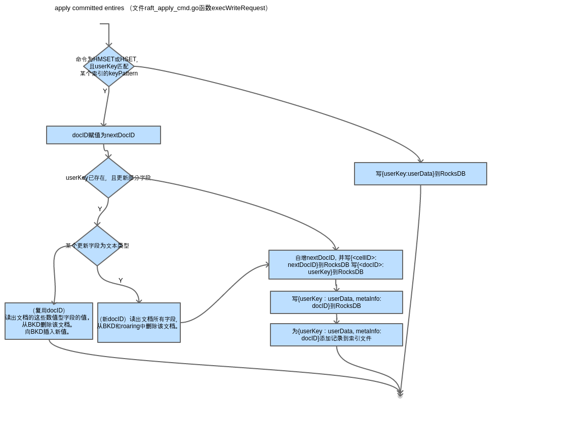
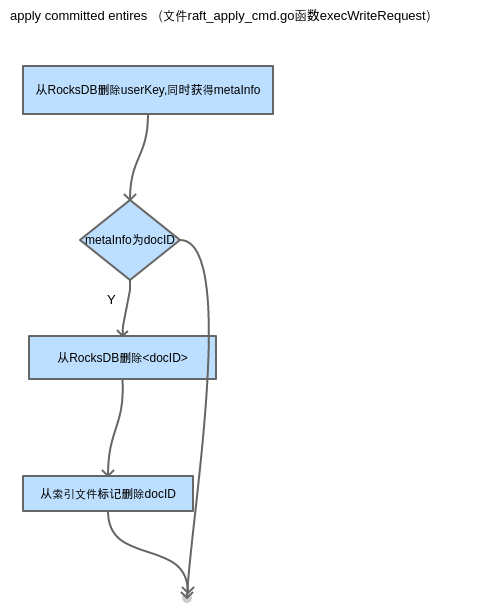
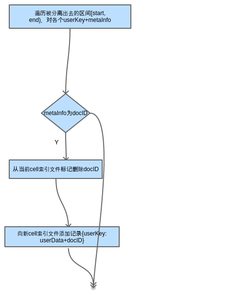
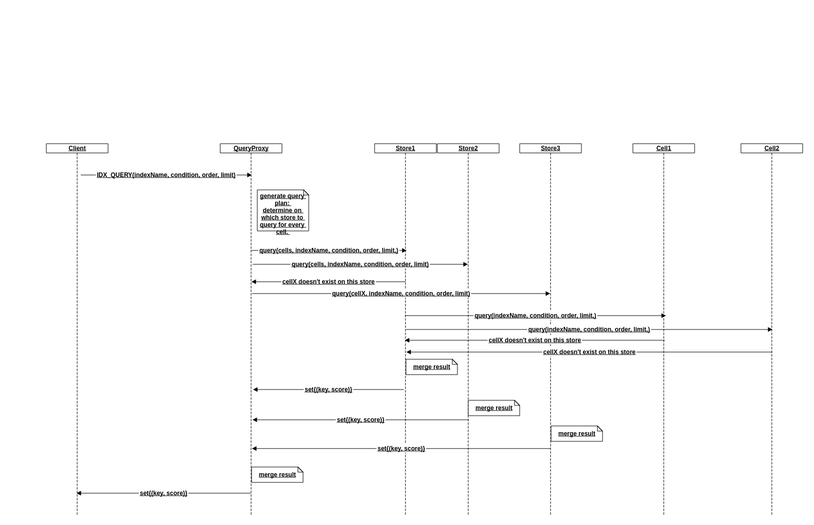

# Elasticell indexer module design

## Overview

Elasticell提供了Redis兼容接口。indexer模块在此基础上提供次级索引的创建、删除和查询功能。
设计原则：

- 不改变Redis兼容接口语义。这是显然的。
- 增加尽量少的API。所有主流的Redis client SDK都要撸一遍。
- 索引查询结果是用户的提供的key，而非某种内部表达如document_id。

## 新增API

以下命令仅限于管理界面调用：

- `IDX_CREATE <index_name> <key_pattern> <filed1_name> <field1_type> {<field2_name> <field2_type> ...}`
- `IDX_DELETE <index_name>`


允许创建多个索引。各个索引具有不同的name和key_pattern。下面的命令：

```bash
IDX_CREATE orders orders_\d+ price UINT64 date UINT64
IDX_CREATE products products-\d+ price UINT64 date UINT64
HSET orders_100 price 30 date 2017
HSET products-100 price 20 date 2015
```

由于"products-100"匹配正则表达式“products-\d+”，所以“HSET products-100...”触发了索引动作，向名为“products”的索引表添加记录。

注： 用户使用Redis作为缓存时的习惯做法，大多数时候key包括适合作为document_id的数字，例如上面的products-100中的“100”就是相应RDBMS table中对应行的主键。但有时候则不然，例如

- `person-<id>`中的id(身份证号)为长达18个数字或者字符'X'，所以id并不适合表达为uint64_t。
- `account-<id>`中的id(银行帐号)为长达21个数字，将来可能加长。
- `car-<id>`中的id(汽车牌照)是数字和字符的混合体。

为了顺应用户习惯，本模块的key_pattern并不要求某个sub-pattern为纯数字。

以下命令需要添加到Redis client SDK:

- `IDX_QUERY <index_name> <field1_name> <compare> <number1> <field2_name> CONTAINS <word2> [LIMIT <number>]`

举例如下：

```bash
redis> IDX_QUERY products price > 10
["products-100"]
redis> IDX_QUERY products price > 20
[]
```

## 内部设计

假设：

- 用户创建hashtable时使用HMSET或者HSET命令设置全部或者部分fields
- 用户更新hashtable时使用HMSET或者HSET命令更新部分或者全部fields
- 用户不使用HDEL删除部分fields，而是使用DEL删除整个hashtable

每个cell负责该region内所有KV的索引。索引记录的增删由KV的增删改以及region分裂迁移触发。

### docID管理
docID为uint64整数，在文档被插入时刻决定。更新文档将导致其ID发生变化。

docID为elasticell集群范围内唯一的。目的是在cell split时无需改动映射docID->userKey。

每个cell维护一个计数器用于下一个需要索引文档的ID。该计数器持久化在RocksDB中，并且附带在生成的snapshot中。目的是确保cell到其他store迁移后，其产生的docID序列不会与follower peers已有docID交叠。

为了确保分配全局docID的性能，以及同一cell分配的docID尽量连续，cell每次从PD申请定长（2^16以适应Roaring需求）范围的docID。

### HMSET/HSET创建和更新document

HMSET userKey field1 val1 field2 val2 field3 val3
HMSET userKey field1 val1 field2 val2
HSET userKey field1 val1



### DEL删除document

DEL userKey



### split

cell的split成两个cells后，文档仍然存储在同一个RocksDB实例中。与DEL类似，不同之处在于批量删除。


### 迁移

对于迁移走的cell，执行go-nemo提供的RangeDelete：

RangeDelete(start, end []byte, func cb(metaInfo []byte))

回调函数cb执行如下动作：从RocksDB删除`<docID>`、从索引文件标记删除`<docID>`。

对于新位置的cell，在apply snapshot时，执行上文提到的HSET。
snapshot的内容是：

- `{<cellID>: nextDocID}`
- `{userKey：userData, metaInfo: docID}`

在apply snpashot时，扫描整个snapshot以重建如下映射：

- `{<docID>: userKey}`

### 搜索

引入新角色QueryProxy负责生成查询计划、聚合查询结果。


